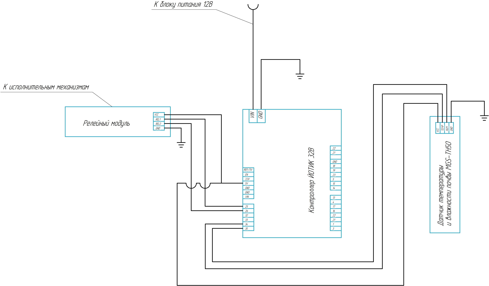
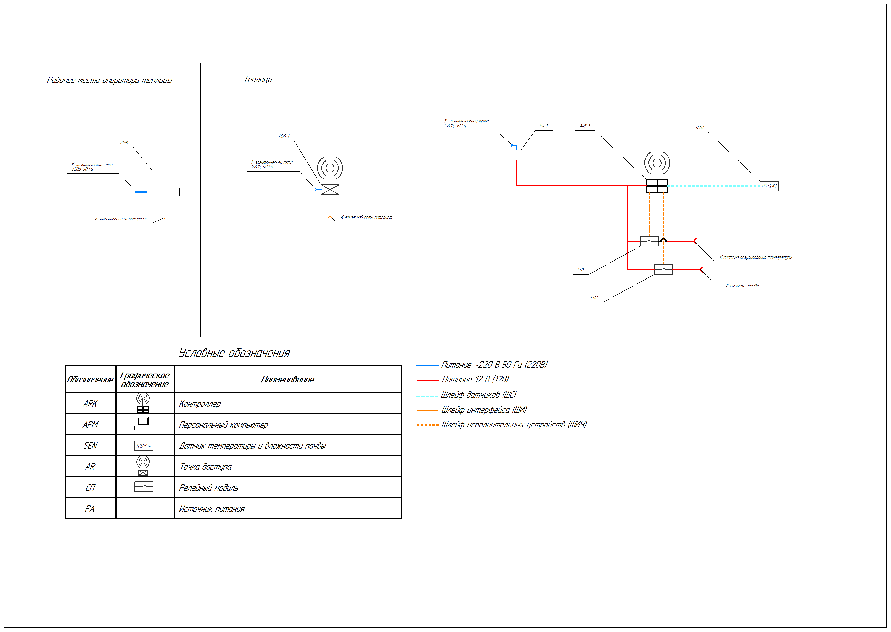
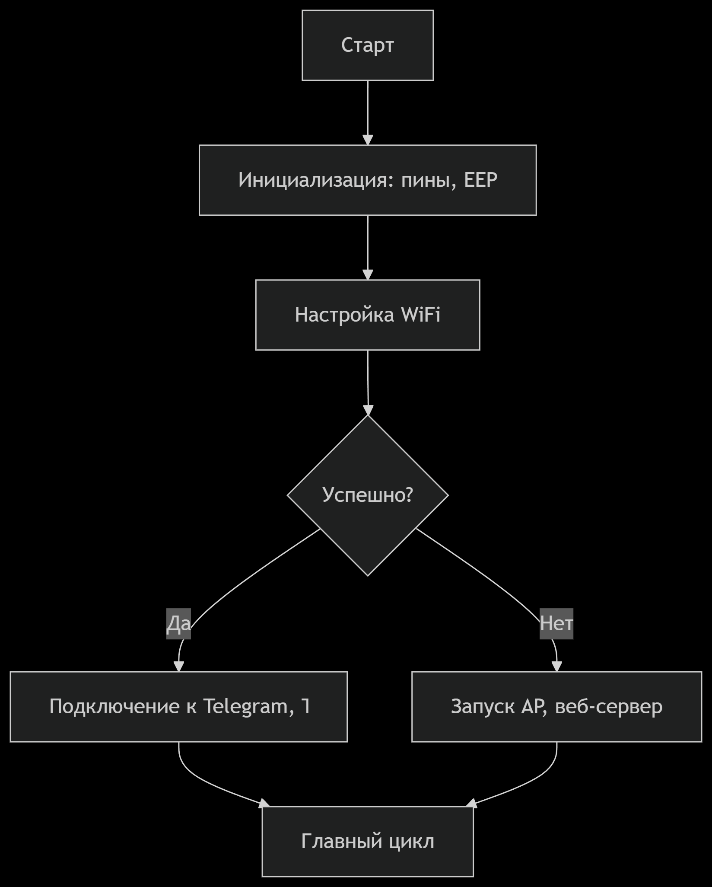
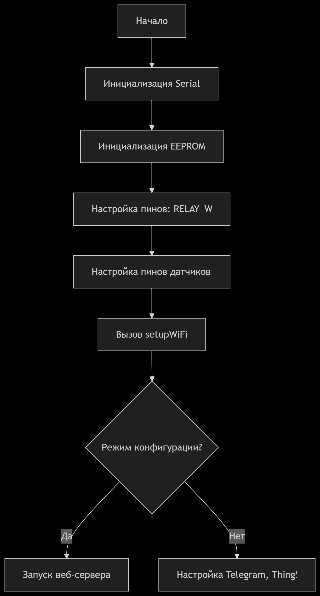
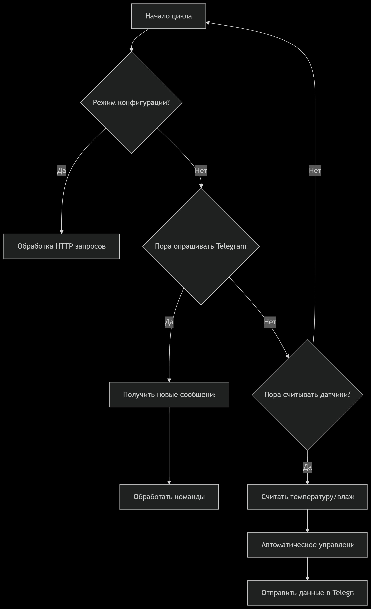
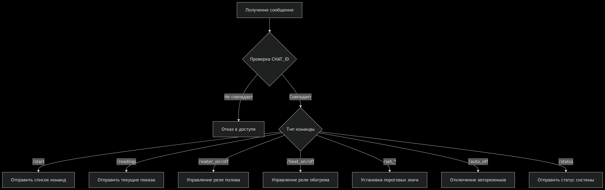
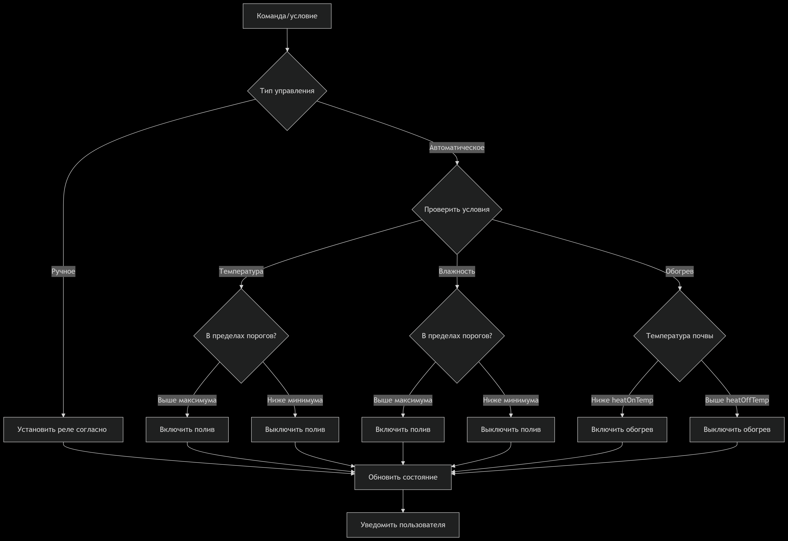
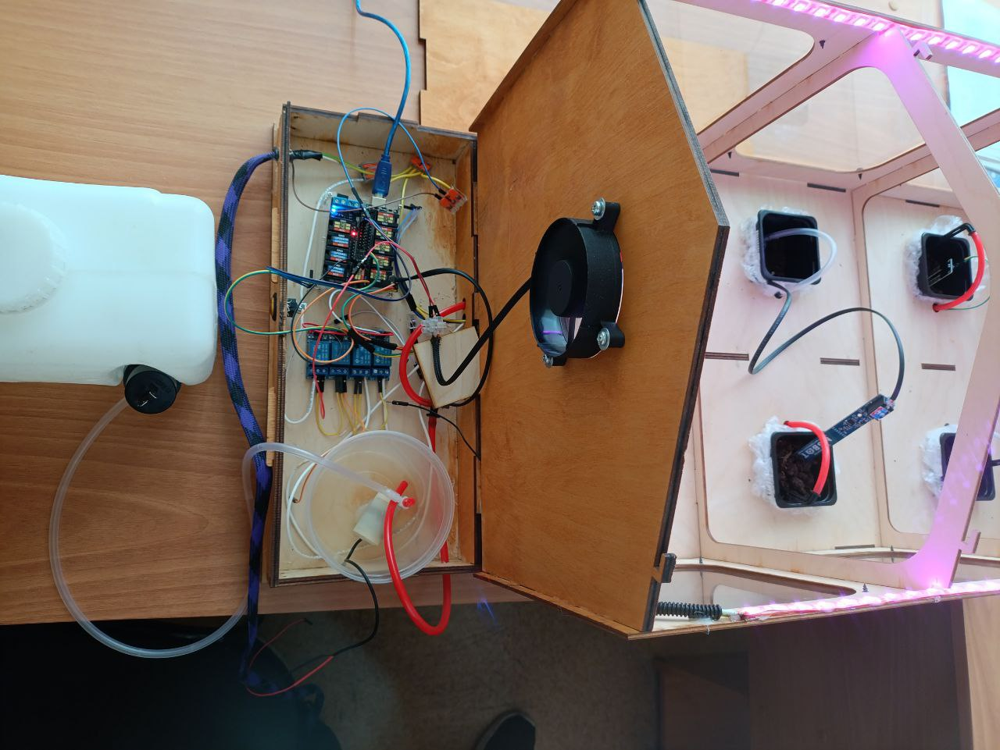
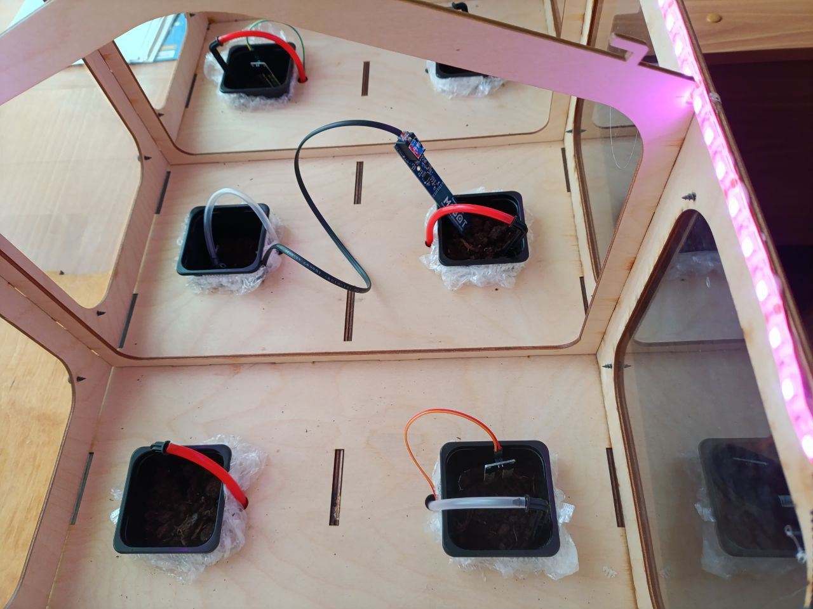
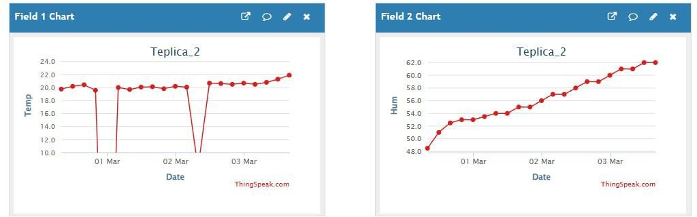

# Управление капельным поливом с использованием датчика влажности почвы

## 📋 Общая информация

### Назначение устройства и решаемые проблемы

Разработанная система на базе контроллера ЙоТик 32В (ESP32) предназначена для автоматического мониторинга температуры и влажности почвы, а также управления поливом в теплицах. Она решает ключевые задачи:

- Контроль температуры и влажности почвы (с помощью датчика MGS-TH50).
- Управление реле для полива и обогрева на основе заданных параметров.
- Интеграция с Telegram и ThingSpeak для удалённого доступа и визуализации данных.

### Ключевые преимущества

- ✅ Повышение урожайности
- ✅ Снижение затрат
- ✅ Удобство удалённого контроля
- ✅ Масштабируемость

### Применение

- Научные исследования
- Коммерческие теплицы
- Образовательные проекты

---

## 🛠 Используемое оборудование

- Контроллер Иотик 32В (ESP32)
- Датчик температуры и влажности почвы: MGS-TH50
- Релейный модуль
- Блок питания 12В 3А

---

## 📊 Схемы




---

## 🧱 Стек технологий

**Язык:** C++ (Arduino IDE)

### Библиотеки:

- WiFi
- WiFiClientSecure
- UniversalTelegramBot
- ArduinoJson
- ThingSpeak
- WebServer
- EEPROM
- Wire

---

## ⚙ Настройка

Перед загрузкой замените в коде:

```cpp
const char DEFAULT_SSID[] = "****";
const char DEFAULT_PASS[] = "****";
const char BOTtoken[] = "****";
const char CHAT_ID[] = "****";
const char thingspeakApiKey[] = "****";
unsigned long thingspeakChannelID = ****;
```

### Как получить токен Telegram-бота

1. Создайте бота через [@BotFather](https://t.me/BotFather)
2. Получите CHAT_ID через `https://api.telegram.org/bot<ТОКЕН>/getUpdates`

---

## 🌐 ThingSpeak

1. Зарегистрируйтесь на [thingspeak.com](https://thingspeak.com)
2. Создайте канал с полями:
   - Field 1: Влажность почвы
   - Field 2: Температура почвы
   
---

## 🚀 Первый запуск

1. Если Wi-Fi не подключится, создается точка "Teplica_2"
2. Подключитесь к ней и откройте `192.168.4.1`
3. Введите Wi-Fi данные

---

## 🤖 Управление через Telegram

| Команда | Описание |
|--------|----------|
| `/start` | Показать список команд |
| `/water_on` / `/water_off` | Включить/выключить полив |
| `/heat_on` / `/heat_off` | Включить/выключить обогрев |
| `/set_hum min max` | Автоматическое управление влажностью |
| `/set_temp min max` | Автоматическое управление температурой |
| `/auto_off` | Отключение режимов |
| `/readings` | Показания датчиков |
| `/status` | Текущий статус системы |

---

## ❗ Возможные проблемы

- Нет данных в ThingSpeak → проверьте API и интернет
- Реле не срабатывает → проверьте питание

---

## 🔁 Алгоритмы

- Алгоритм работы

- Алгоритм запуска

- Главный цикл

- Получение команд

- Управление реле


---

## 📷 Прототип




---

## 📑 Примеры отчётов

- Данные в Telegram


- Данные в ThingSpeak


